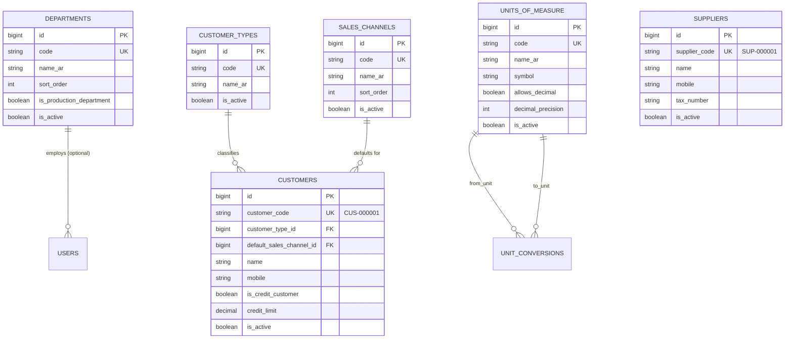

# توثيق المرحلة الثالثة: البيانات الأساسية (Master Data Foundation)
**نظام إدارة الإنتاج الداخلي — مصنع مفروشات سدير (Sadir Furniture Factory)**

---

## 1. نظرة عامة والهدف من المرحلة (Overview & Objective)

تؤسس **المرحلة الثالثة (Stage 3)** الركيزة المرجعية الأساسية (Master Data) التي تعتمد عليها المراحل اللاحقة لإدارة المبيعات، خطوط الإنتاج، المخزون، وحساب التكاليف. 

تم تصميم هذه الجداول بنية نظيفة وعالية الكفاءة، مع الالتزام الصارم بـ:
- دعم كامل لبيئة الاستضافة المشتركة (Hostinger Shared Hosting / MariaDB).
- واجهة مستخدم عربية كاملة RTL بخط القاهرة ومكتبات Bootstrap 5.
- سياسة صارمة لمنع الحذف الفعلي (Soft/Operational Deactivation عبر حقل `is_active`).
- عزل كامل بين الصلاحيات الأمنية (Roles) والأقسام التشغيلية المكانية (Factory Departments).

---

## 2. النماذج والجداول الأساسية (Core Master Data Entities)

---

## 3. تفاصيل الوحدات المرجعية (Entity Breakdown)

### 3.1 قنوات البيع (Sales Channels)
تمثل مسارات توزيع منتجات المصنع والجهات التي تستقبل طلبات التصنيع:
1. `SADIR_STORE`: متجر مفروشات سدير (المعرض الرئيسي المملوك للمصنع).
2. `WHOLESALE`: تجار ومعارض الجملة الخارجية.
3. `DIRECT`: البيع المباشر للأفراد والمستهلكين النهائيين.
4. `CUSTOM`: مشاريع وتوريدات خاصة (فنادق، شقق مفروشة، قصور).

### 3.2 تصنيفات العملاء (Customer Types)
تصنيف العملاء وفق طبيعة العلاقة التجارية:
1. `DIRECT_CUSTOMER`: عميل أفراد وتجزئة مباشر.
2. `WHOLESALE_CUSTOMER`: عميل جملة وموزع معتمد.
3. `SADIR_STORE`: حساب متجر مفروشات سدير الداخلي (كعميل استراتيجي لطلبات المعرض).
4. `BUSINESS_CUSTOMER`: شركات ومؤسسات ومشاريع الضيافة.

### 3.3 سجل العملاء (Customers)
- **التسلسل الآلي للأكواد**: يتم توليد كود العميل تلقائياً بنسق `CUS-000001`، `CUS-000002` إلخ عبر دالة `Customer::generateNextCode()`.
- **العميل الخاص المسجل مسبقاً**: تم إدراج عميل "متجر مفروشات سدير" بالكود `CUS-000001` في الـ Seeder كحساب افتراضي لطلبات معارض المصنع.
- **قواعد الائتمان والمديونية**:
  - إذا كان `is_credit_customer = false` (نقدي)، يجب أن يكون الحد الائتماني `null`.
  - إذا كان `is_credit_customer = true` (آجل)، يجب تحديد حد ائتماني أقصى موجب (`credit_limit >= 0`).

### 3.4 سجل الموردين (Suppliers)
- **التسلسل الآلي للأكواد**: نسق `SUP-000001`، `SUP-000002` عبر دالة `Supplier::generateNextCode()`.
- **البيانات الداعمة**: تشمل الشخص المسؤول، الجوال، الهاتف، البريد، الرقم الضريبي (15 رقم)، رقم السجل التجاري، وشروط التوريد والملاحظات.

### 3.5 وحدات القياس (Units of Measure)
تم إدراج الوحدات الأساسية للمصنع:
- `METER`: متر طولي (م) — يقبل كسور عشرية بدقة خانتين (للأقمشة، الهيدبورد، إلخ).
- `BOARD`: لوح (للخشب MDF، والخشب السويدي، والكونتر).
- `PIECE`: حبة / قطعة (أعداد صحيحة فقط بدون كسور، للأرجل، المسامير، المفصلات).
- `CARTON`: كرتون (للتغليف ومستلزمات التجميع).
- `PACK`: باكت (للإبر، الدبابيس).
- `SHEET`: فرخ (لأفرخ الإسفنج واللباد).
- `KG`: كيلوغرام (للغراء والمواد السائلة).
- `LITER`: لتر.
- `ROLL`: رول (لرولات الأقمشة والتغليف الشفاف والبابلز).

> **ملاحظة معمارية هامة بشأن معاملات التحويل (Packaging Conversions)**:  
> تم إنشاء جدول `unit_conversions` للتحويلات الرياضية العامة الثابتة (مثل المتر إلى سم، أو الكيلوجرام إلى جرام). أما معاملات التعبئة المتغيرة لكل مادة (مثل كرتون يحتوي 1000 مسمار مقابل كرتون يحتوي 24 مقبض) فمكانها الصحيح والمحدد هو إعدادات المادة الخام في المرحلة الرابعة وما بعدها (`material_conversions`).

### 3.6 أقسام وورش المصنع (Factory Departments)
تمثل خطوط الإنتاج والورش ومحطات التجميع:
1. `CARPENTRY`: ورشة النجارة وتفصيل الهياكل (إنتاجي، ترتيب 10).
2. `FOAM`: ورشة السفنجة وقص الإسفنج (إنتاجي، ترتيب 20).
3. `UPHOLSTERY`: ورشة التنجيد وخياطة الأقمشة (إنتاجي، ترتيب 30).
4. `BOX_PRODUCTION`: خط إنتاج البوكسات المشاعة (إنتاجي، ترتيب 40).
5. `BOX_PREPARATION`: تلبيس وتجهيز البوكسات (إنتاجي، ترتيب 50).
6. `ASSEMBLY`: التجميع النهائي والتركيب (إنتاجي، ترتيب 60).
7. `PACKAGING`: الفحص النهائي والتغليف (إنتاجي، ترتيب 70).
8. `WAREHOUSE`: مستودع المواد الخام واللوت (لوجستي، ترتيب 80).
9. `DELIVERY_INSTALLATION`: التوصيل والتركيب الميداني (خدمي، ترتيب 90).

---

## 4. الفصل المعماري بين الدور الوظيفي والقسم (Role vs. Department)

تم ترسيخ مبدأ معماري جوهري:
- **الدور (Role)**: يحدد **الصلاحيات الأمنية والسياسات البرمجية** لما يستطيع المستخدم فعله في النظام (View, Create, Update, Delete, Approve).
- **القسم (Department)**: يحدد **مكان العمل التشغيلي** للمستخدم داخل المصنع وورشة العمل التي ينتمي إليها.
- يرتبط المستخدم بقسم تشغيلي عبر حقل `users.department_id` وهو حقل اختياري (`nullable`) مع قيد `nullOnDelete()` لضمان عدم تأثر الحسابات عند تعديل الأقسام.

---

## 5. سياسة منع الحذف واستراتيجية التعطيل (Operational Status Strategy)

منعاً لفساد البيانات التاريخية وفقدان التناسق المالي والإنتاجي عند ربط هذه الكيانات بأوامر تصنيع وفواتير لاحقة:
- تم استبعاد مسارات `destroy` من الموارد المرجعية.
- تم تزويد جميع الكيانات بمسارات تحويل الحالة:
  - `POST /customers/{customer}/toggle-status`
  - `POST /suppliers/{supplier}/toggle-status`
  - `POST /sales-channels/{sales_channel}/toggle-status`
  - `POST /customer-types/{customer_type}/toggle-status`
  - `POST /units/{unit}/toggle-status`
  - `POST /departments/{department}/toggle-status`
- توفر جميع النماذج نطاق استعلام `scopeActive($query)` لتصفية العناصر النشطة فقط في القوائم المنسدلة للعمليات الجديدة.

---

## 6. الصلاحيات المضافة (Stage 3 Permissions)

تم تسجيل الصلاحيات الجديدة وتوزيعها على الأدوار المناسبة:
- `sales_channels.view`, `sales_channels.manage`
- `customer_types.view`, `customer_types.manage`
- `units.view`, `units.manage`
- `departments.view`, `departments.manage`
- إضافة لصلاحيات المرحلة السابقة: `customers.view`, `customers.create`, `customers.update`, `suppliers.view`, `suppliers.manage`.

---

## 7. الاختبارات الآلية والتحقق (Automated Verification)

تغطي مجموعة الاختبارات الآلية `tests/Feature/MasterData/` 100% من متطلبات المرحلة:
1. `CustomerTest.php`: اختبار التصفية، الترقيم التلقائي، عملاء النقد والآجل، حدود الائتمان، التحديث وتبديل الحالة.
2. `SupplierTest.php`: اختبار الترقيم التلقائي للأكواد، الحقول الضريبية، تفاصيل المورد، التعديل، وتبديل الحالة.
3. `SalesChannelTest.php`: اختبار وجود القنوات التلقائية، الإضافة، التحديث، وتغيير الحالة.
4. `CustomerTypeTest.php`: اختبار التصنيفات الافتراضية، الإضافة، التعديل، وتغيير الحالة.
5. `UnitOfMeasureTest.php`: اختبار وجود وحدات القياس، دعم الكسور العشرية والدقة، والتعديل.
6. `DepartmentTest.php`: اختبار أقسام خط الإنتاج، الترتيب التسلسلي، ربط الموظفين بالأقسام عبر `users.department_id`.
7. `SecurityTest.php`: التحقق من حظر الضيوف والمستخدمين غير المصرح لهم من الوصول لبيانات التعديل (403 Forbidden).

إجمالي الاختبارات التي تم اجتيازها بنجاح: **50 اختباراً و199 تأكيداً (Assertions)** بدون أي أخطاء.
